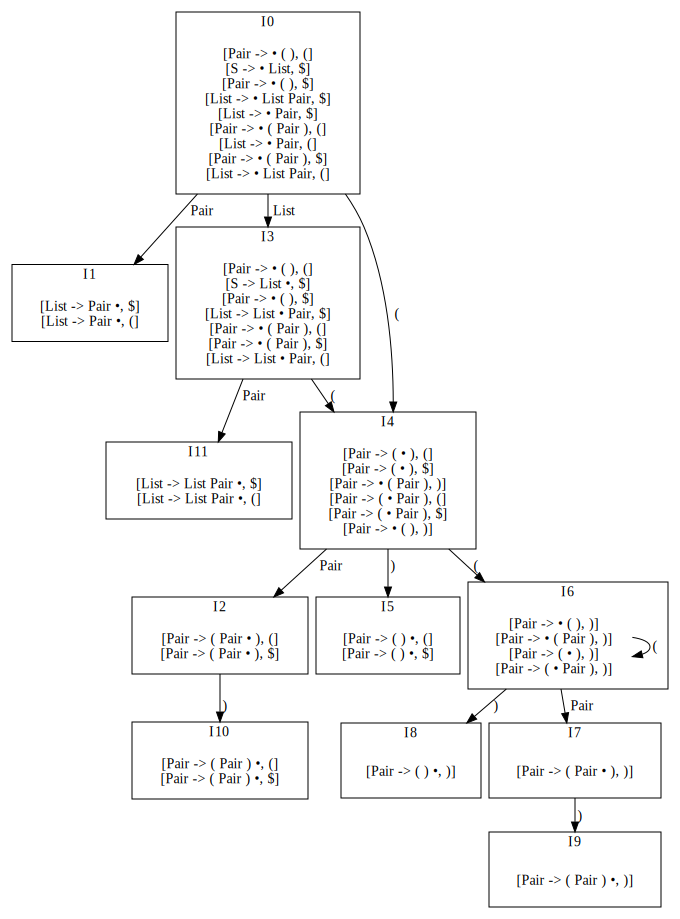
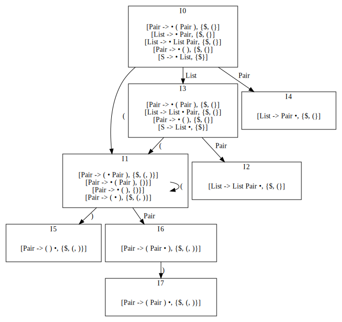

# Syntax Analysis

Implementation of syntax analysis tools in Python.

To not creating parsing table for LR(1) by hand.

## Table of Contents
* [Example](#example)
   * [First and Follow](#first-and-follow)
   * [Create LL(1) Parsing Table](#create-ll1-parsing-table)
   * [Create LR(1) Parsing Table](#create-lr1-parsing-table)
      * [Construct LR(1) Canonical Set](#construct-lr1-canonical-set)
   * [Create LALR(1) Parsing Table](#create-lalr1-parsing-table)
* [How to Use](#how-to-use)


## Example

Representing a classic expression grammar:

```
Expr -> Expr + Term
      | Expr - Term
      | Term

Term -> Term * Factor
      | Expr / Term
      | Factor
	  
Factor -> num | ( Expr )
```
code:
```python
from syntax_analysis import Grammar, Terminal, NonTerminal
from pprint import pprint

Expr = NonTerminal('Expr')
Term = NonTerminal('Term')
Factor = NonTerminal('Factor')
plus = Terminal('+')
minus = Terminal('-')
times = Terminal('*')
div = Terminal('/')
num = Terminal('num')
lp, rp = Terminal('('), Terminal(')')

# Expr is starting symbol
G = Grammar(Expr)
G.add_production(Expr, [Expr, plus, Term])
G.add_production(Expr, [Expr, minus, Term])
G.add_production(Expr, [Term])
G.add_production(Term, [Term, times, Factor])
G.add_production(Term, [Expr, div, Term])
G.add_production(Term, [Factor])
G.add_production(Factor, [num])
G.add_production(Factor, [lp, Expr, rp])
pprint(G)
# Grammar(start_symbol=Expr,
#         productions=[Expr -> Expr + Term,
#                      Expr -> Expr - Term,
#                      Expr -> Term,
#                      Term -> Term * Factor,
#                      Term -> Expr * Term,
#                      Term -> Factor,
#                      Factor -> num,
#                      Factor -> ( Expr )])
```

alternatively, use shorthand functions to define terminals and non-terminals:

```python
from syntax_analysis import terminals, non_terminals

Expr, Term, Factor = non_terminals('Expr', 'Term', 'Factor')
plus, minux, div = terminals('+', '-', '/')
# ...
```


### First and Follow

using the same classic expression grammar

```python
from syntax_analysis import first, follow
print(first(Expr, G))  # {(, num)}
print(follow(Expr, G)) # {), /, $, -, +}
```


### Create LL(1) Parsing Table

The grammar is

```
S -> + S S | * S S | a
```
and the `LL(1)` parsing table for this grammar is

| Terminal |     +      |     *      |   a    |  $   |
| :------: | :--------: | :--------: | :----: | :--: |
|    S     | S -> + S S | S -> * S S | S -> a |      |

code:

```python
from syntax_analysis import LL1, ...

S = NonTerminal('S')
plus, times, a = terminals('+', '*', 'a')
G = Grammar(S)
G.add_production(S, [plus, S, S])
G.add_production(S, [times, S, S])
G.add_production(S, [a])
pprint(LL1.construct_parsing_table(G))
# output:
# {(S, *): {S -> * S S},
#  (S, +): {S -> + S S},
#  (S, a): {S -> a}}
```


### Create LR(1) Parsing Table

Now use the grammar defines balanced parentheses pairs:

```
Start -> List

List -> List Pair | Pair
	  
Pair -> ( Pair ) | ( )
```


#### Construct LR(1) Canonical Set

The LR(1) grammar of the above parentheses grammar is


You can use the information collected to convert them to desired format (e.g. LATEX). The canonical set is generated by:

```python
from syntax_analysis import LR1

Start, List, Pair = non_terminals('S', 'List', 'Pair')
lp, rp = terminals('(', ')')
G = Grammar(Start)
G.add_production(Start, [List])
G.add_production(List, [List, Pair])
G.add_production(List, [Pair])
G.add_production(Pair, [lp, Pair, rp])
G.add_production(Pair, [lp, rp])

pprint(LR1.construct_canonical_set(G))
# output:
#   CanonicalSet(...)
```

---

Next, create the parsing table is as:

```python
pprint(LR1.construct_parsing_table(G))
# output:
#	ParsingTable(states=...,
#                    action=...,
#                    goto=...)
```



(the dot file of graph above is generated by simple function `generate_automaton_graphviz` in `misc.py`)


### Create LALR(1) Parsing Table

The API for creating `LALR(1)` parsing table is similar in `LALR1.py`:

- `LALR1.construct_canonical_set(G)`
- `LALR1.construct_parsing_table(G)`

```python
from syntax_analysis import LALR1
from syntax_analysis.misc import generate_automaton_graphviz(pt)
G = ... # balanced parentheses grammar
pt = LALR1.construct_parsing_table(G)
print(generate_automaton_graphviz(pt))
```




## How to Use

Download the repository, rename the folder to `syntax_analysis`, place it where you want to use.
